# FYP-ImageGenie

## This project is developed for my final year project

## Introduction
The goal of this project is to develop an application that can increase the resolution of low quality images and to perform neural style transfer that composes one image in the style of another image. In today's digital age, images play a crucial role in communication and self-expression. However, low-quality images are a common problem that many people encounter, particularly when taking pictures with their mobile phones. The lack of image quality can result in images that are blurry, pixelated, or have poor resolution. These low-quality images can be frustrating for users who want to share their images on social media platforms or use them for personal or professional purposes. In this project, several pretrained deep convolutional neural networks model that are the Enhanced Deep Residual Network (EDSR), Efficient Sub-Pixel Convolutional Neural Network (ESPCN) and deep Laplacian Pyramid Super-Resolution Network (LapSRN) are used for increasing the resolution of image and the result of each model is analyzed and compared. The EDSR was chosen as the best model as it achieved the highest average PSNR and SSIM in testing 45 images which are 25.82 dB and 0.70 respectively. Traditional image processing applications often lack the ability to perform advanced image enhancement techniques such as neural style transfer, which can be used to create artistic effects on images. The neural style transfer functionality is achieved by extracting the style of the style image using the VGG19 network architecture which is a pretrained image classification network and apply to the content image to create artistic effects on images. Finally, an application is built using Flutter that combines all the functions above.

# System Architecture 

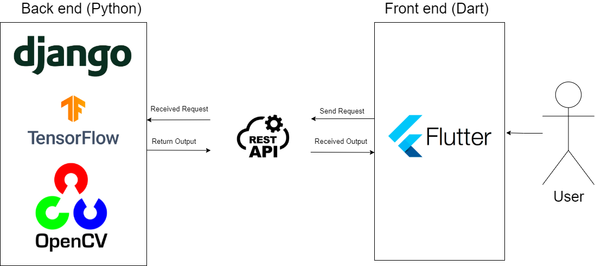

The system architecture is shown in Figure above where the frontend part is developed using Flutter which is a framework to create cross platform applications. The user will upload the image through the mobile application and the request will be sent to the backend using Rest API. The image will then load using OpenCV and processed using Tensorflow in the backend based on the choice of user in which image enhancement they want to do. 

# Full Poster

[Click to view full poster](Assets/poster.pdf)

# Full Article Paper

[Click to  view full article paper](Assets/article.pdf)

# Full Report

[Click to view full report](Assets/report.pdf)

# Performance of Deep Learning Models

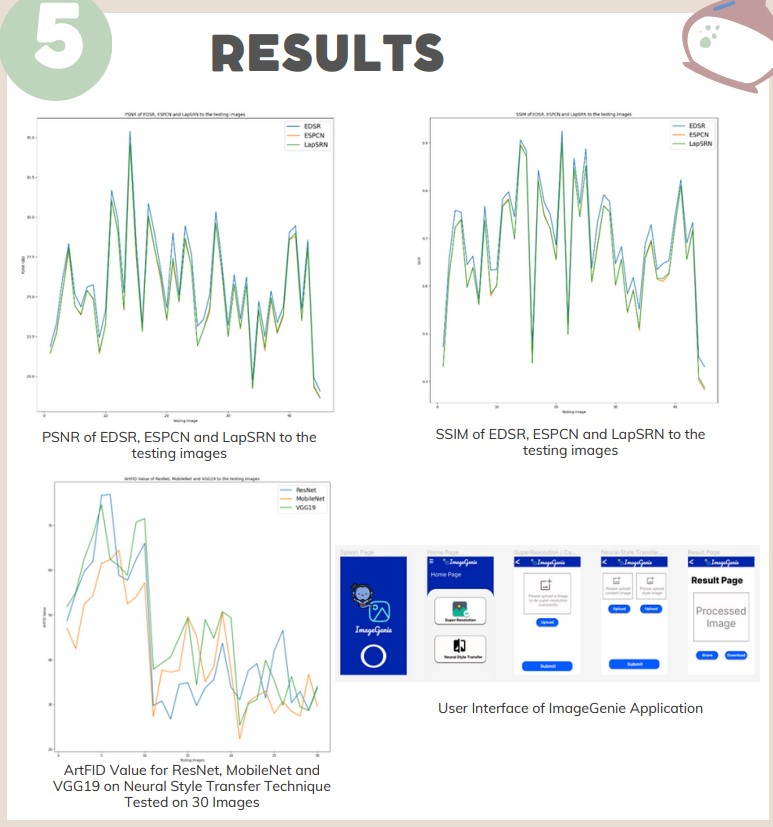

# Results

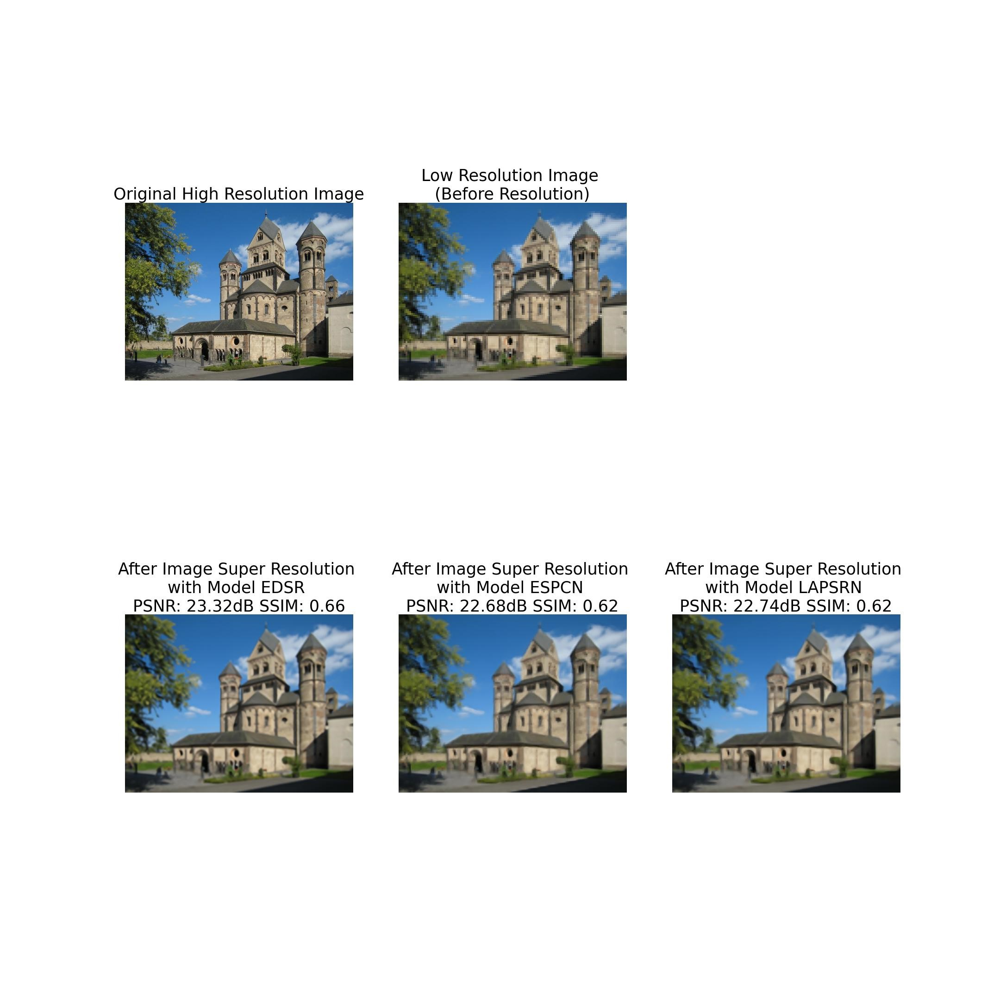

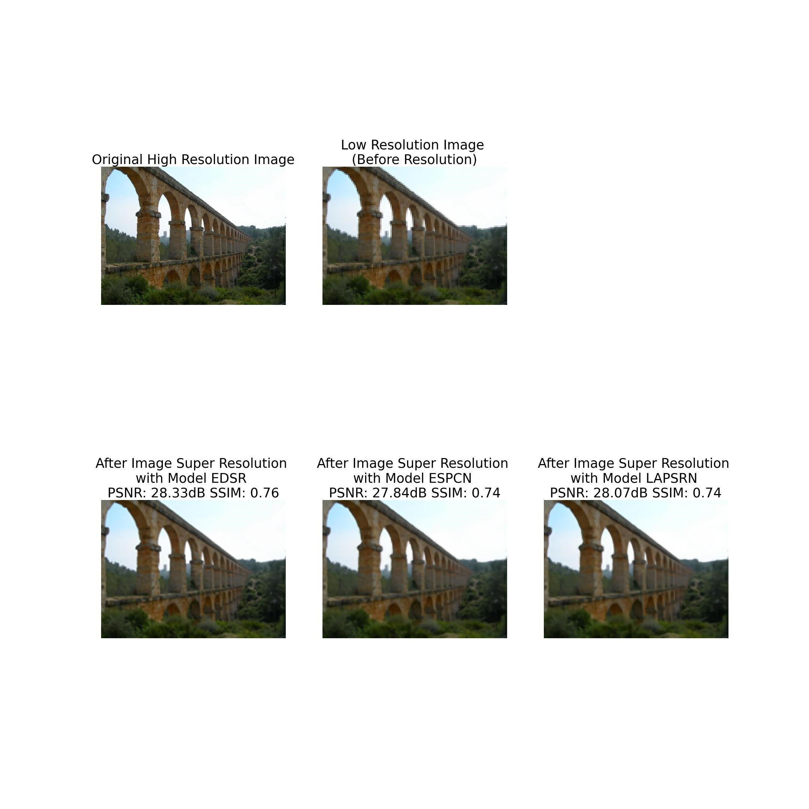

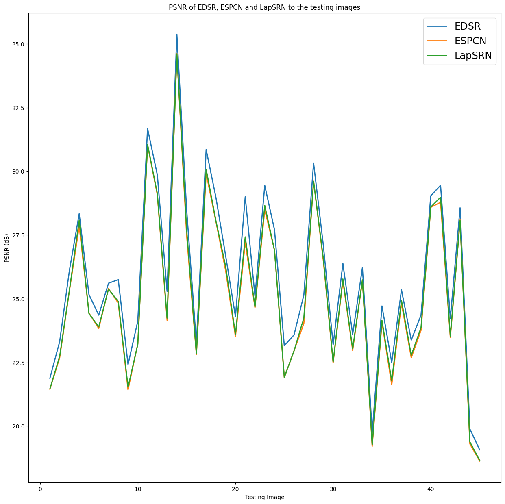

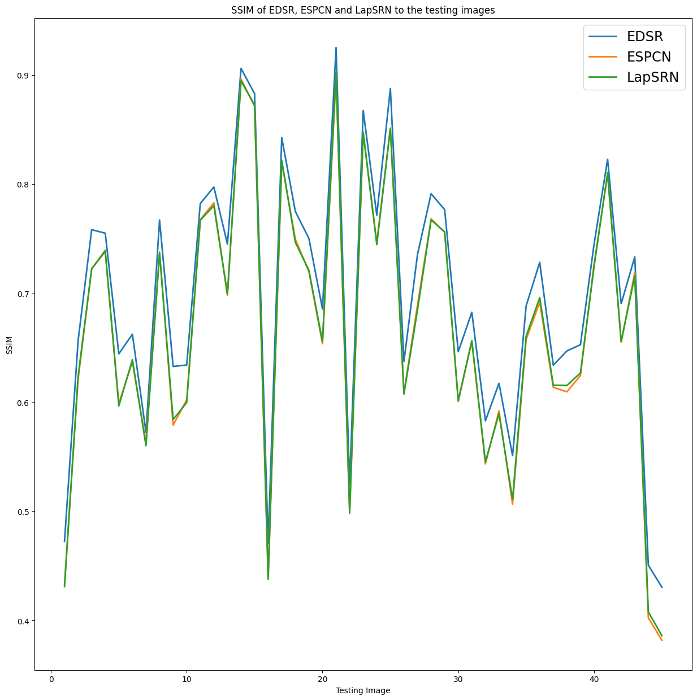

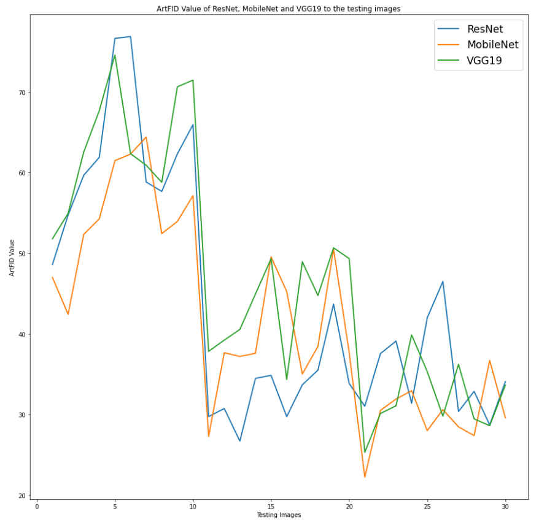

# Mobile Application Interace

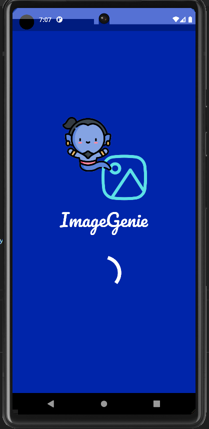

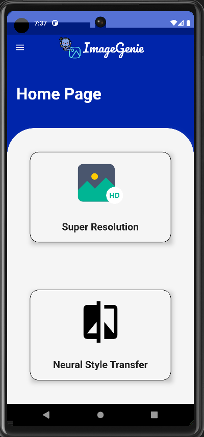

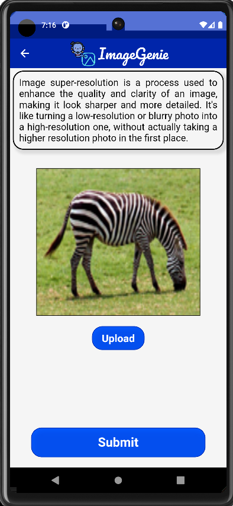

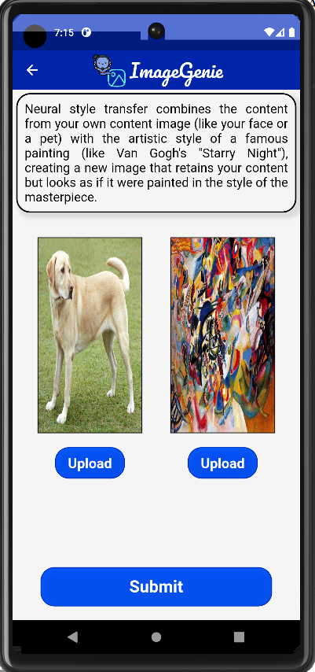

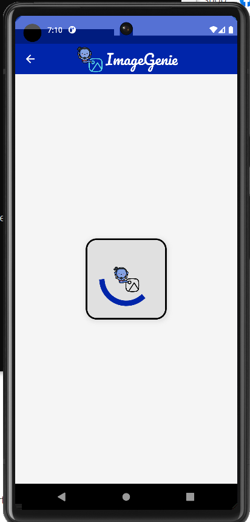

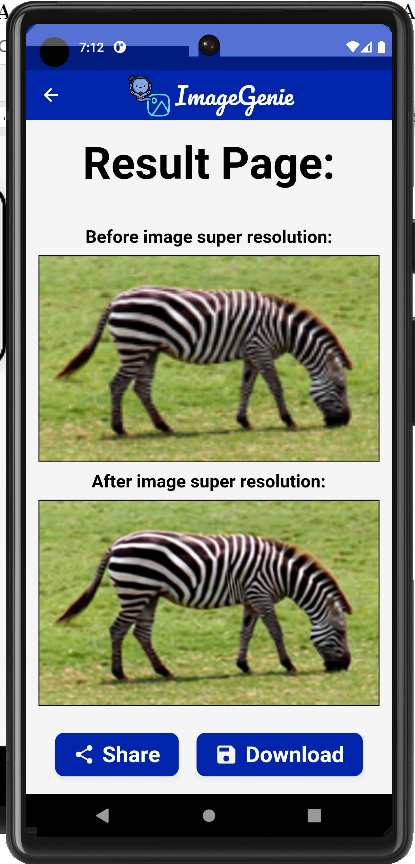

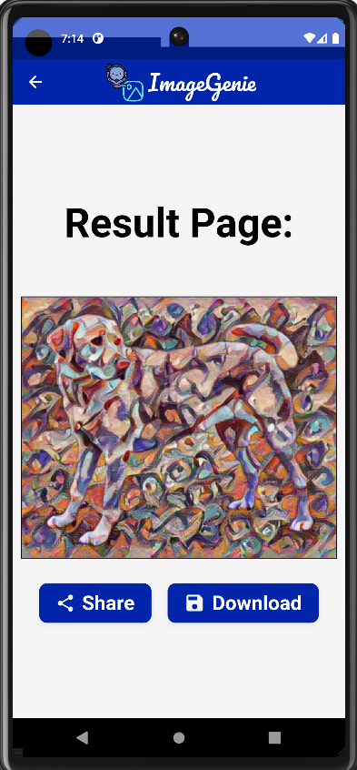

# Installation

- You need to have python version 3.10.4 installed in ur computer. If not, can download from  https://www.python.org/downloads/release/python-3104/

### The steps to construct the backend environment are listed below:
1. Firstly, the user need to clone the source code of this project from GitHub, then the user need to navigate to the backend directory which is the ```django_api``` directory.
2. Then, type the following command in the command prompt to install relevant dependencies and libraries ```pip install -r requirements.txt```
3. To ensure that the libraries were installed successfully, the user can run the following command to see a list of installed packages, ```pip list```.
4. With the required libraries installed, the user can start running the backend server. The user can start the development server using the following command, ```python manage.py runserver 0.0.0.0:8000```.

- In order to construct the frontend, the user need to install Flutter version 3.0.5 from the [official website](https://docs.flutter.dev/get-started/install). This entailed downloading the SDK from the official Flutter website and subsequently extracting it to a chosen directory within the local machine's file system.

### The steps to construct the frontend environment are listed below:
1. Firstly, the user need to download the source code of this project from GitHub, then the user need to navigate to the backend directory which is the ```image_genie_app``` directory.
2. Then, the user can start running the frontend application. The user can start the mobile application using the following command in the command prompt, ```flutter run```.

